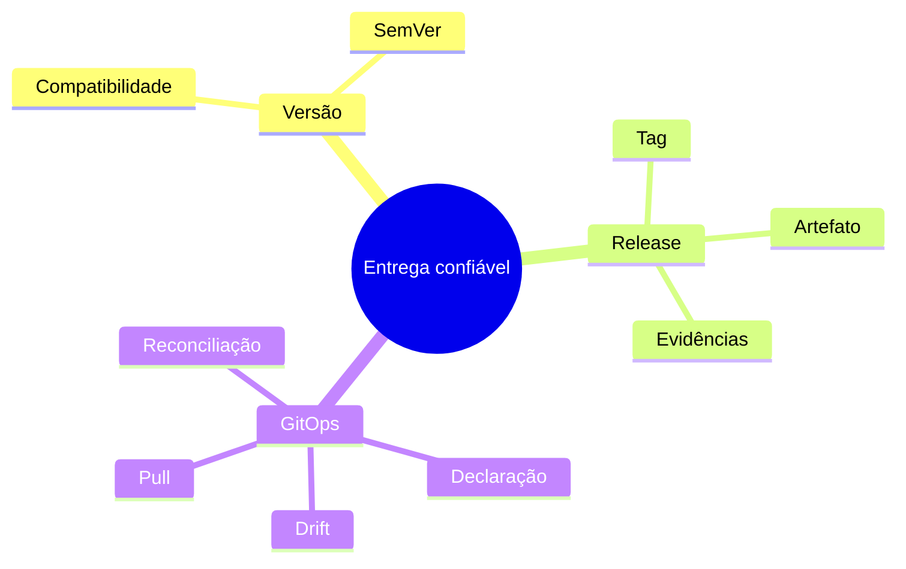

# Resumo

- versão comunica compatibilidade de uma API pública;
- tag identifica um ponto Git; release empacota publicação e comunicação;
- artefatos publicados são imutáveis e promovidos por digest;
- assinatura, proveniência e SBOM respondem perguntas diferentes;
- release, deploy, promoção e ativação são eventos distintos;
- rollback precisa considerar estado e migrações de dados;
- GitOps exige declaração, versionamento, pull automático e reconciliação contínua;
- drift é diferença observável entre intenção e realidade;
- segredos exigem gestão própria e identidade mínima;
- governança combina revisão, política, auditoria, métricas e break-glass.

O laboratório aplica esses invariantes em um reconciliador determinístico.
