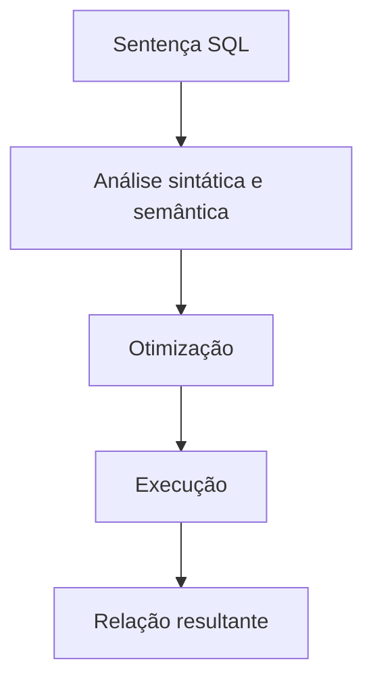

# Introdução

Sistemas de dados precisam responder perguntas sem obrigar o usuário a programar como percorrer páginas, índices ou arquivos. SQL resolve esse problema ao permitir declarar **qual relação resultante** se deseja.

O otimizador pode trocar a ordem de joins, selecionar índices e escolher algoritmos sem alterar a semântica. Essa separação entre intenção e mecanismo oferece produtividade, mas exige formular corretamente conjuntos, predicados e contratos.

SQL inclui sublinguagens para definição, consulta, manipulação, controle e transações. Este primeiro módulo concentra os fundamentos de definição e consulta.

> [!note]
> Produtos implementam dialetos. O padrão oferece uma base comum, enquanto tipos, funções e detalhes sintáticos podem variar.
