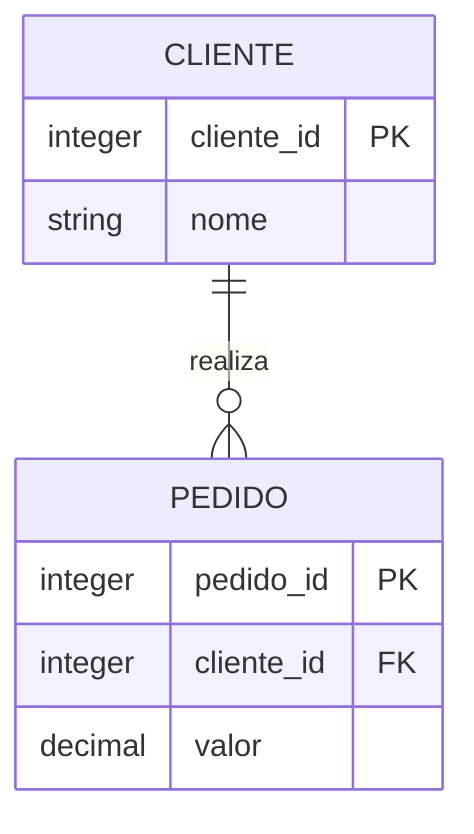

# Modelo Relacional: Relações, Tuplas e Domínios

Uma relação é um conjunto de tuplas definido sobre atributos e domínios. O schema descreve estrutura; o estado contém as tuplas em determinado instante.



No modelo formal, relações não têm ordem e não contêm duplicatas. SQL trabalha com tabelas e, por padrão, permite resultados com duplicatas; por isso é frequentemente descrito como baseado em multiconjuntos.

Operações centrais incluem seleção de tuplas, projeção de atributos, produto, join, união e diferença. Uma consulta compõe essas operações.

```sql
SELECT nome
FROM clientes
WHERE cidade = 'Recife';
```

Aqui, `WHERE` seleciona tuplas e `SELECT nome` projeta um atributo. A ordem só passa a fazer parte do resultado quando `ORDER BY` é solicitado.

> [!note]
> Uma linha física não é a definição de uma tupla. Armazenamento e ordem física são decisões do SGBD.
