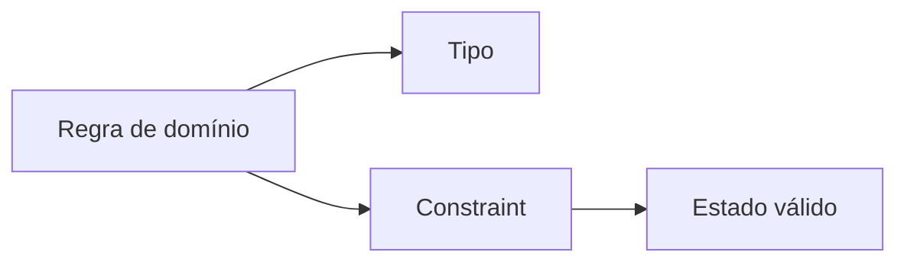

# Esquemas, Tabelas, Tipos, Chaves e Restrições

Uma boa tabela representa um tipo de fato. Tipos limitam representações; chaves identificam; restrições recusam estados inválidos.

```sql
CREATE TABLE clientes (
    cliente_id INTEGER PRIMARY KEY,
    nome TEXT NOT NULL,
    email TEXT UNIQUE,
    ativo INTEGER NOT NULL DEFAULT 1 CHECK (ativo IN (0, 1))
);

CREATE TABLE pedidos (
    pedido_id INTEGER PRIMARY KEY,
    cliente_id INTEGER NOT NULL REFERENCES clientes(cliente_id),
    valor NUMERIC NOT NULL CHECK (valor >= 0)
);
```

Chave primária identifica cada linha. Chave candidata também poderia identificá-la; chave estrangeira preserva referência. `NOT NULL`, `UNIQUE`, `CHECK` e `DEFAULT` expressam invariantes distintos.



Tipos SQL e coerção variam entre produtos. SQLite possui tipagem dinâmica com afinidades; bancos como PostgreSQL aplicam tipos de modo mais rígido. Não dependa de coerções implícitas.

> [!tip]
> Garanta no banco as regras que devem valer independentemente da aplicação que escreve os dados.
