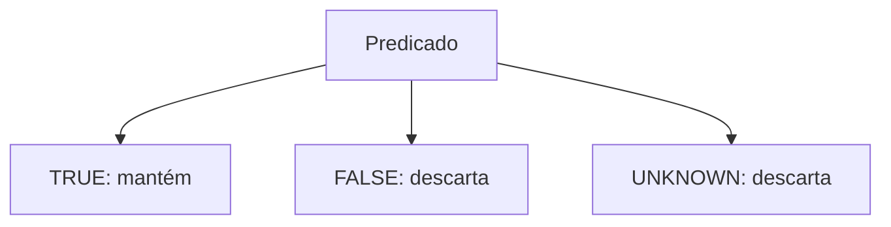

# Filtros, NULL, DISTINCT e Ordenação

`WHERE` mantém linhas cujo predicado resulta em verdadeiro. SQL usa lógica de três valores: verdadeiro, falso e desconhecido. Comparações com `NULL` normalmente produzem desconhecido.

```sql
SELECT cliente_id, email
FROM clientes
WHERE email IS NULL;
```

`email = NULL` está errado; use `IS NULL` ou `IS NOT NULL`. Operadores comuns incluem comparação, `BETWEEN`, `IN`, `LIKE`, `AND`, `OR` e `NOT`. Parênteses tornam precedência explícita.

```sql
SELECT DISTINCT cidade
FROM clientes
WHERE ativo = 1
ORDER BY cidade ASC;
```

`DISTINCT` elimina duplicatas do resultado completo, não corrige joins mal definidos. `ORDER BY` pode usar múltiplas chaves; acrescente uma chave única para paginação determinística.



> [!warning]
> `NOT IN` combinado com um conjunto que contenha `NULL` pode produzir resultados inesperados. Analise a lógica ou use `NOT EXISTS` quando apropriado.
