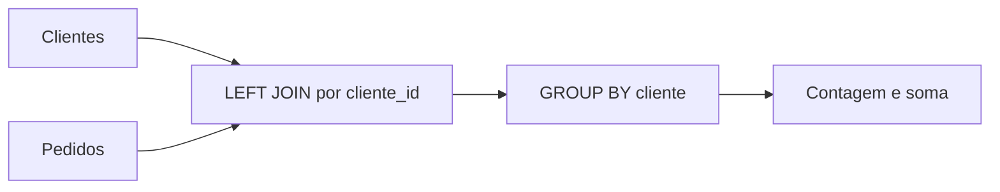

# Composição, Joins, Agregação e Portabilidade

Joins combinam linhas segundo um predicado. Agregações reduzem grupos a valores resumidos. Ambos serão aprofundados, mas são necessários para fechar o raciocínio fundamental.

```sql
SELECT
    c.cliente_id,
    c.nome,
    COUNT(p.pedido_id) AS quantidade_pedidos,
    COALESCE(SUM(p.valor), 0) AS valor_total
FROM clientes AS c
LEFT JOIN pedidos AS p
    ON p.cliente_id = c.cliente_id
GROUP BY c.cliente_id, c.nome
ORDER BY valor_total DESC, c.cliente_id;
```

`INNER JOIN` mantém correspondências. `LEFT JOIN` preserva todas as linhas da esquerda. Colocar um filtro da tabela direita em `WHERE` pode eliminar linhas nulas e transformar, na prática, o resultado externo.



`COUNT(*)` conta linhas; `COUNT(coluna)` ignora nulos. Colunas não agregadas devem pertencer ao agrupamento segundo as regras do dialeto.

Portabilidade exige conhecer o núcleo comum e testar tipos, funções, quoting, tratamento de datas, concatenação e paginação em cada destino.
