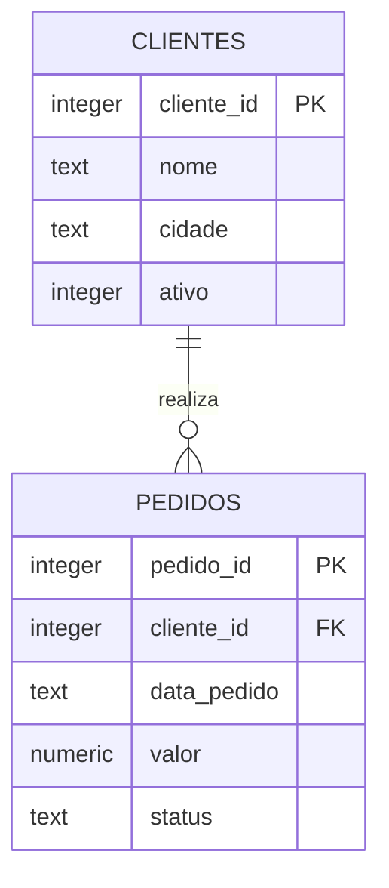

# Estudo de Caso — DataRetail S.A.

A DataRetail S.A. precisa substituir planilhas divergentes por um conjunto mínimo de fatos sobre clientes e pedidos. O primeiro contrato define identificadores estáveis, obrigatoriedade e integridade referencial.



O time começa com perguntas verificáveis:

```sql
SELECT c.nome, COUNT(p.pedido_id) AS pedidos
FROM clientes AS c
LEFT JOIN pedidos AS p ON p.cliente_id = c.cliente_id
GROUP BY c.cliente_id, c.nome
ORDER BY pedidos DESC, c.cliente_id;
```

O schema impede pedido sem cliente e valor negativo. Consultas nomeiam colunas explicitamente e usam ordenação determinística. Diferenças de dialeto ficam documentadas perto do código.

> [!example]
> A ausência de pedidos não é o mesmo que cliente inexistente. Por isso o relatório usa `LEFT JOIN` e conta `pedido_id`, não `COUNT(*)`.

Esse modelo pequeno sustenta o laboratório e será expandido nos próximos módulos de SQL.
