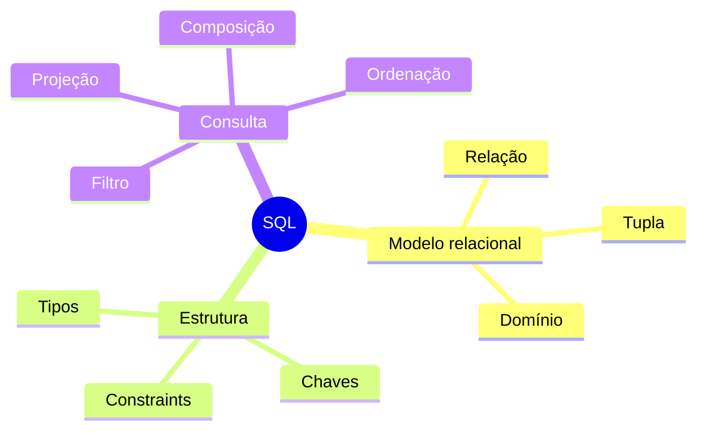

# Resumo

- SQL declara resultados e permite ao SGBD escolher mecanismos;
- o padrão fornece uma base, mas produtos possuem dialetos;
- relação, tupla, atributo e domínio sustentam o raciocínio;
- tabelas SQL podem conter duplicatas e não têm ordem implícita;
- tipos, chaves e constraints preservam invariantes;
- `FROM` e `WHERE` são logicamente avaliados antes de `SELECT`;
- `NULL` introduz o valor lógico desconhecido;
- `DISTINCT` remove duplicatas, enquanto `ORDER BY` define ordem;
- expressões derivam valores e conversões devem ser explícitas;
- joins combinam relações e agregações resumem grupos;
- portabilidade exige disciplina e testes.

O próximo passo é consolidar tudo no [[14-Laboratorio|laboratório reproduzível]].
