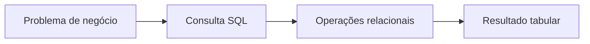

# Módulo 01 — Fundamentos de SQL e Modelo Relacional

SQL expressa o resultado desejado sobre relações, deixando ao sistema gerenciador a escolha do plano de execução. Este módulo constrói vocabulário, raciocínio relacional e consultas fundamentais antes de avançar para recursos especializados.

## Percurso

1. [[01-Objetivos|Objetivos]]
2. [[02-Introducao|Introdução]]
3. [[03-Origens-Padroes-e-Natureza-Declarativa-do-SQL|Origens, Padrões e Natureza Declarativa do SQL]]
4. [[04-Modelo-Relacional-Relacoes-Tuplas-e-Dominios|Modelo Relacional: Relações, Tuplas e Domínios]]
5. [[05-Esquemas-Tabelas-Tipos-Chaves-e-Restricoes|Esquemas, Tabelas, Tipos, Chaves e Restrições]]
6. [[06-SELECT-Projecao-Aliases-e-Ordem-Logica|SELECT, Projeção, Aliases e Ordem Lógica]]
7. [[07-Filtros-NULL-DISTINCT-e-Ordenacao|Filtros, NULL, DISTINCT e Ordenação]]
8. [[08-Expressoes-Funcoes-CASE-e-Conversoes|Expressões, Funções, CASE e Conversões]]
9. [[09-Composicao-Joins-Agregacao-e-Portabilidade|Composição, Joins, Agregação e Portabilidade]]
10. [[10-Estudo-de-Caso-DataRetail|Estudo de Caso — DataRetail S.A.]]
11. [[11-Resumo|Resumo]]
12. [[12-Perguntas-de-Entrevista|Perguntas de Entrevista]]
13. [[13-Exercicios|Exercícios]] e [[13-Gabarito|Gabarito]]
14. [[14-Laboratorio|Laboratório]] e [[14-Solucao|Solução]]
15. [[15-Referencias|Referências]]

