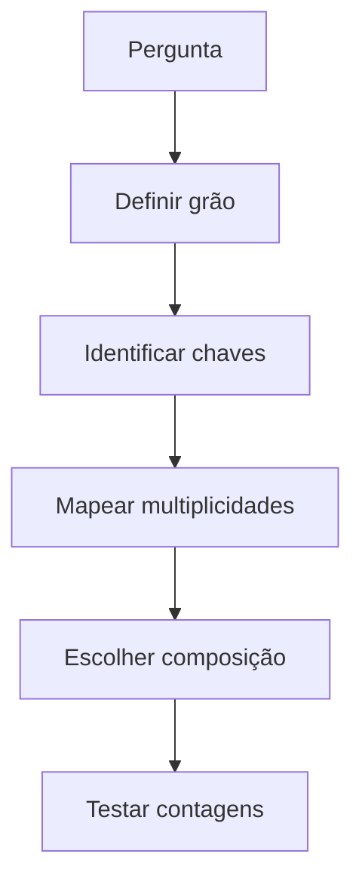

# Introdução

Dados normalizados distribuem fatos entre tabelas. Consultar pedidos, clientes, itens e produtos exige recompor relações sem inventar ou perder ocorrências.

Um join correto sintaticamente pode estar errado semanticamente. Se um pedido possui vários itens e vários pagamentos, juntar ambos diretamente pelo pedido multiplica combinações. A solução começa no grão, não em `DISTINCT`.

Subconsultas e CTEs expressam etapas intermediárias. Elas não são automaticamente mais rápidas ou lentas; o otimizador decide estratégias conforme semântica, estatísticas e dialeto.

> [!warning]
> Sempre compare contagem de linhas e unicidade das chaves antes e depois de uma composição.
