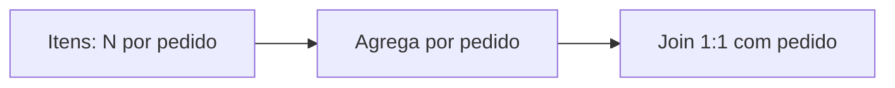

# Expressões de Tabela, Grão e Cardinalidade

Uma expressão de tabela produz uma tabela virtual que outras cláusulas transformam. Pode ser nome, join, subconsulta, função tabular ou combinação.

**Grão** descreve o que cada linha representa. “Uma linha por pedido” e “uma linha por item” são contratos diferentes. Cardinalidade é a quantidade de linhas ou a multiplicidade entre conjuntos.

| Relação | Multiplicidade | Risco |
| --- | --- | --- |
| cliente → pedido | 1:N | cliente se repete |
| pedido → pagamento | 1:N | pedido se repete |
| pedido ↔ cupom | N:N | multiplicação combinatória |

```sql
SELECT cliente_id, COUNT(*) AS pedidos
FROM pedidos
GROUP BY cliente_id;
```

Pré-agregar ao grão necessário antes do join é uma defesa contra fanout.



Valide chaves com `COUNT(*)`, `COUNT(DISTINCT chave)` e busca por grupos com contagem maior que um. `DISTINCT` no final pode esconder o erro e distorcer somas.
