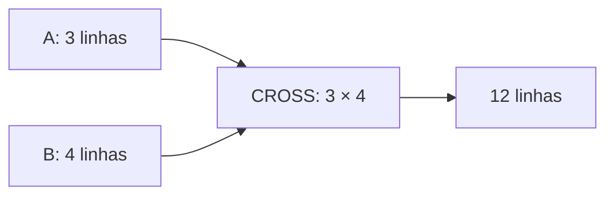

# INNER, CROSS e Predicados de Join

`INNER JOIN` retorna combinações cujo predicado é verdadeiro. `CROSS JOIN` retorna o produto cartesiano e é apropriado quando toda combinação é intencional.

```sql
SELECT p.pedido_id, c.nome
FROM pedidos AS p
INNER JOIN clientes AS c
    ON c.cliente_id = p.cliente_id;
```

O predicado deve representar a relação de negócio. Juntar somente por nome, data ou código parcial cria correspondências acidentais.

```sql
SELECT l.loja_id, d.data
FROM lojas AS l
CROSS JOIN calendario AS d;
```

Esse segundo exemplo gera uma grade loja-data útil para detectar lacunas.



`USING (coluna)` reduz repetição quando nomes coincidem, mas `ON` torna condições complexas explícitas. Evite sintaxe antiga com tabelas separadas por vírgula: esquecer o predicado causa produto cartesiano silencioso.

> [!tip]
> Qualifique colunas com aliases curtos e significativos em qualquer consulta com mais de uma fonte.
