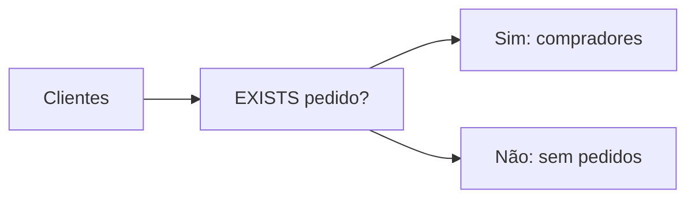

# OUTER JOIN, Semi-join e Anti-join

`LEFT JOIN` preserva todas as linhas da esquerda e completa colunas da direita com `NULL` quando não existe correspondência.

```sql
SELECT c.cliente_id, p.pedido_id
FROM clientes AS c
LEFT JOIN pedidos AS p
    ON p.cliente_id = c.cliente_id
   AND p.status = 'pago';
```

Mover `p.status = 'pago'` para `WHERE` eliminaria clientes sem pedido pago. Predicados em `ON` definem correspondência; em `WHERE`, filtram o resultado formado.

Semi-join pergunta se existe ao menos uma correspondência, sem duplicar a linha externa:

```sql
SELECT c.cliente_id, c.nome
FROM clientes AS c
WHERE EXISTS (
    SELECT 1 FROM pedidos AS p WHERE p.cliente_id = c.cliente_id
);
```

Trocar por `NOT EXISTS` implementa anti-join e encontra ausência.



Prefira `NOT EXISTS` a `NOT IN` quando a subconsulta puder produzir `NULL`, pois a lógica de três valores pode tornar o predicado desconhecido.
