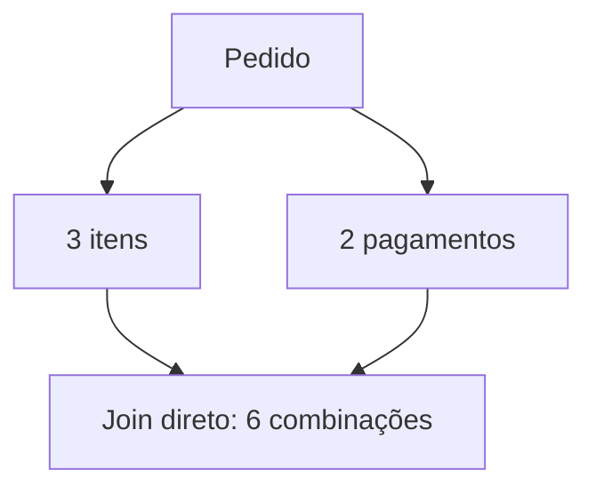

# Self-join, Múltiplos Joins e Fanout

Self-join usa a mesma relação em papéis diferentes. Aliases são obrigatórios para distinguir cada instância.

```sql
SELECT f.nome AS funcionario, g.nome AS gestor
FROM colaboradores AS f
LEFT JOIN colaboradores AS g
    ON g.colaborador_id = f.gestor_id;
```

Em múltiplos joins, desenhe o caminho e identifique multiplicidades. Juntar duas relações filhas 1:N ao mesmo pai produz até N×M linhas por pai.



Para totalizar itens e pagamentos por pedido, agregue cada filho separadamente e depois faça joins 1:1:

```sql
WITH itens AS (
    SELECT pedido_id, SUM(valor) AS total_itens
    FROM itens_pedido GROUP BY pedido_id
)
SELECT p.pedido_id, i.total_itens
FROM pedidos AS p
LEFT JOIN itens AS i ON i.pedido_id = p.pedido_id;
```

Sinais de fanout incluem totais inflados, chaves repetidas e uso defensivo de `DISTINCT` sem explicação.
