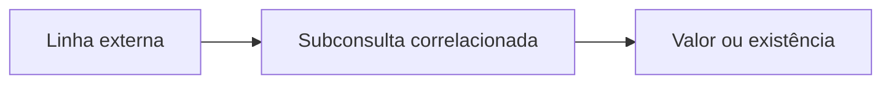

# Subconsultas Escalares, Derivadas e Correlacionadas

Uma subconsulta escalar deve retornar no máximo um valor; uma tabela derivada aparece em `FROM`; uma correlacionada referencia colunas da consulta externa.

```sql
SELECT pedido_id, valor
FROM pedidos
WHERE valor > (SELECT AVG(valor) FROM pedidos);
```

```sql
SELECT faixa, COUNT(*) AS quantidade
FROM (
    SELECT CASE WHEN valor >= 100 THEN 'alto' ELSE 'baixo' END AS faixa
    FROM pedidos
) AS classificados
GROUP BY faixa;
```

```sql
SELECT c.cliente_id,
       (SELECT MAX(p.valor)
        FROM pedidos AS p
        WHERE p.cliente_id = c.cliente_id) AS maior_pedido
FROM clientes AS c;
```



Correlação descreve dependência lógica, não garante execução linha a linha: o otimizador pode reescrever. Ainda assim, subconsultas escalares repetidas podem ser menos claras que pré-agregação com join.

> [!warning]
> Se uma subconsulta escalar retornar várias linhas, a maioria dos SGBDs sinaliza erro. Garanta unicidade por contrato, não por `LIMIT 1` arbitrário.
