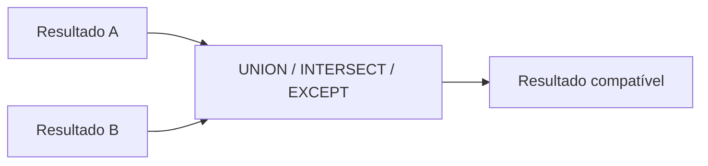

# EXISTS, IN, ANY, ALL e Operações de Conjunto

`EXISTS` testa presença de linhas. `IN` compara com os valores de uma coluna. `ANY` exige ao menos uma comparação verdadeira; `ALL`, todas. Suporte e detalhes variam por dialeto.

```sql
SELECT pedido_id, valor
FROM pedidos
WHERE valor > ALL (
    SELECT valor FROM pedidos WHERE cliente_id = 2
);
```

Operações de conjunto combinam resultados com mesmo número de colunas e tipos compatíveis:

| Operador | Resultado |
| --- | --- |
| `UNION` | união sem duplicatas |
| `UNION ALL` | união preservando duplicatas |
| `INTERSECT` | linhas comuns |
| `EXCEPT` | linhas somente à esquerda |

```sql
SELECT email FROM clientes_ativos
UNION
SELECT email FROM leads_qualificados;
```



Use `UNION ALL` quando duplicatas forem válidas ou impossíveis por contrato; eliminar duplicatas tem custo e altera semântica. `ORDER BY` aplica-se ao resultado composto final.
