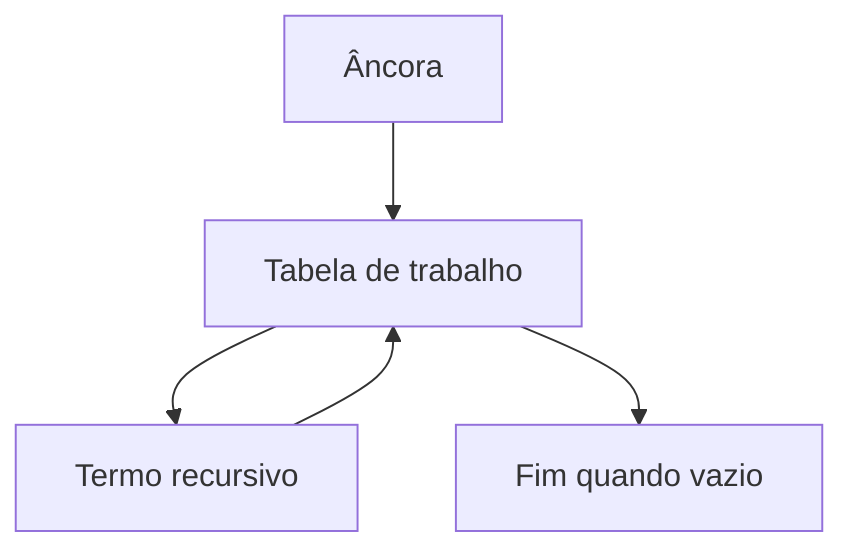

# CTEs, Recursão, Legibilidade e Testabilidade

Uma CTE nomeia uma subconsulta válida durante uma sentença. Ela pode revelar etapas e grãos intermediários.

```sql
WITH totais AS (
    SELECT cliente_id, SUM(valor) AS total
    FROM pedidos
    GROUP BY cliente_id
)
SELECT c.nome, t.total
FROM totais AS t
JOIN clientes AS c ON c.cliente_id = t.cliente_id;
```

CTE recursiva possui termo âncora e termo recursivo, unidos normalmente por `UNION ALL`:

```sql
WITH RECURSIVE numeros(n) AS (
    SELECT 1
    UNION ALL
    SELECT n + 1 FROM numeros WHERE n < 5
)
SELECT n FROM numeros ORDER BY n;
```



Controle ciclos e profundidade ao percorrer grafos. Não presuma que CTE sempre materializa: mecanismos e versões podem inlinear, materializar ou aceitar hints.

Teste cada etapa temporariamente com contagens, unicidade, nulos e somas de controle. Legibilidade nasce de nomes que expressem grão, não de dividir toda consulta mecanicamente.
