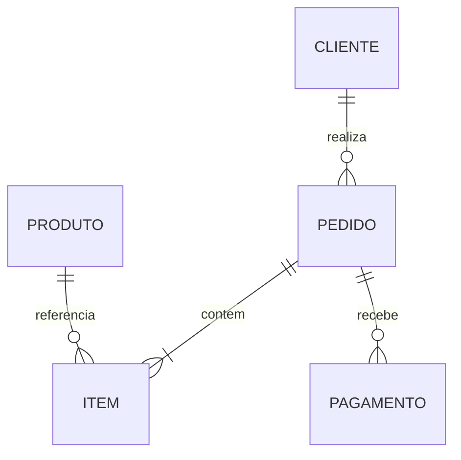

# Estudo de Caso — DataRetail S.A.

A DataRetail S.A. identificou valores duplicados no relatório financeiro. Pedidos eram ligados simultaneamente a itens e pagamentos, ambos 1:N, antes das somas.



O time declarou o grão final como uma linha por pedido. Itens e pagamentos passaram a ser agregados separadamente:

```sql
WITH itens AS (
    SELECT pedido_id, SUM(quantidade * preco_unitario) AS total_itens
    FROM itens_pedido GROUP BY pedido_id
), pagamentos AS (
    SELECT pedido_id, SUM(valor) AS total_pago
    FROM pagamentos GROUP BY pedido_id
)
SELECT p.pedido_id, c.nome, i.total_itens, COALESCE(pg.total_pago, 0) AS total_pago
FROM pedidos AS p
JOIN clientes AS c ON c.cliente_id = p.cliente_id
JOIN itens AS i ON i.pedido_id = p.pedido_id
LEFT JOIN pagamentos AS pg ON pg.pedido_id = p.pedido_id;
```

Anti-join identifica pedidos sem pagamento; CTE recursiva resolve categorias hierárquicas. Testes comparam número de pedidos, unicidade da chave e totais antes e depois.

O problema não era agregação, mas fanout anterior à agregação.
