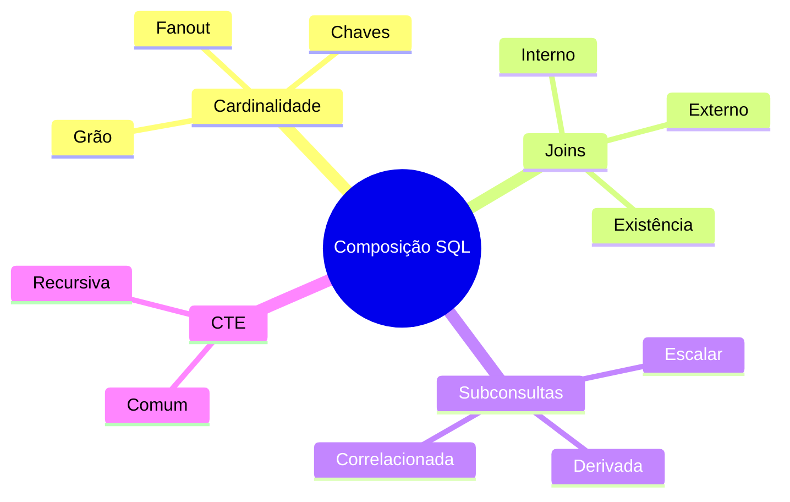

# Resumo

- toda consulta deve declarar seu grão esperado;
- chaves e multiplicidades permitem prever cardinalidade;
- `INNER JOIN` mantém correspondências e `CROSS JOIN` combina tudo;
- outer joins preservam ausência, desde que filtros não a eliminem;
- `EXISTS` e `NOT EXISTS` expressam semi-join e anti-join;
- múltiplas relações 1:N podem causar fanout;
- subconsultas podem ser escalares, derivadas ou correlacionadas;
- operações de conjunto compõem resultados verticalmente;
- CTEs nomeiam etapas e CTEs recursivas percorrem hierarquias;
- materialização é decisão dependente do mecanismo;
- contagem, unicidade e totais de controle testam a semântica.

