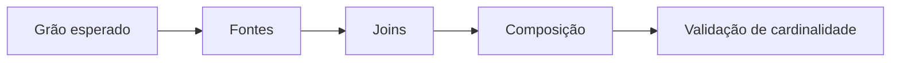

# Módulo 02 — Consultas, Joins e Subconsultas

Consultas reais combinam fatos distribuídos entre relações. A dificuldade central não é memorizar sintaxe, mas preservar o grão esperado enquanto joins, conjuntos e subconsultas transformam cardinalidade.

## Percurso

1. [[01-Objetivos|Objetivos]]
2. [[02-Introducao|Introdução]]
3. [[03-Expressoes-de-Tabela-Grao-e-Cardinalidade|Expressões de Tabela, Grão e Cardinalidade]]
4. [[04-INNER-CROSS-e-Predicados-de-Join|INNER, CROSS e Predicados de Join]]
5. [[05-OUTER-JOIN-Semi-Join-e-Anti-Join|OUTER JOIN, Semi-join e Anti-join]]
6. [[06-Self-Join-Multiplos-Joins-e-Fanout|Self-join, Múltiplos Joins e Fanout]]
7. [[07-Subconsultas-Escalares-Derivadas-e-Correlacionadas|Subconsultas Escalares, Derivadas e Correlacionadas]]
8. [[08-EXISTS-IN-ANY-ALL-e-Operacoes-de-Conjunto|EXISTS, IN, ANY, ALL e Operações de Conjunto]]
9. [[09-CTEs-Recursao-Legibilidade-e-Testabilidade|CTEs, Recursão, Legibilidade e Testabilidade]]
10. [[10-Estudo-de-Caso-DataRetail|Estudo de Caso — DataRetail S.A.]]
11. [[11-Resumo|Resumo]]
12. [[12-Perguntas-de-Entrevista|Perguntas de Entrevista]]
13. [[13-Exercicios|Exercícios]] e [[13-Gabarito|Gabarito]]
14. [[14-Laboratorio|Laboratório]] e [[14-Solucao|Solução]]
15. [[15-Referencias|Referências]]

