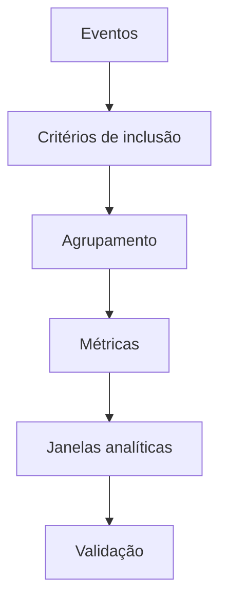

# Introdução

Dados operacionais registram eventos; decisões exigem métricas. Converter eventos em receita diária, participação, ranking ou tendência requer declarar população, grão, ordenação e janela temporal.

`GROUP BY` contrai várias linhas em uma por grupo. Uma função com `OVER` mantém cada linha e acessa uma partição relacionada. Confundir esses mecanismos leva a perda de detalhe ou joins desnecessários.

Uma métrica correta precisa de denominador, tratamento de ausência, unidade, fuso e critério de desempate. A sintaxe é apenas a etapa final.

> [!warning]
> Resultado numericamente plausível não comprova semântica. Valide totais, limites, partições e casos com empates ou datas ausentes.
