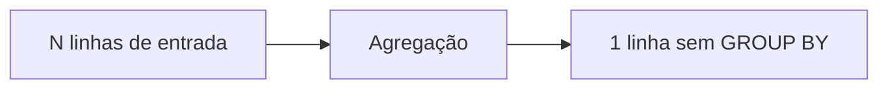

# Agregação, Grão e Funções Fundamentais

Uma função agregada reduz um conjunto de valores a um resultado. `COUNT(*)` conta linhas; `COUNT(expressão)` conta valores não nulos. `SUM`, `AVG`, `MIN` e `MAX` ignoram entradas nulas.

```sql
SELECT
    COUNT(*) AS linhas,
    COUNT(desconto) AS descontos_informados,
    SUM(valor) AS receita,
    AVG(valor) AS ticket_medio
FROM pedidos
WHERE status = 'pago';
```

Exceto `COUNT`, agregações sobre conjunto vazio normalmente retornam `NULL`; `COALESCE` só deve converter isso quando o domínio definir zero.



Tipos de retorno importam. Médias e somas podem promover tipos, sofrer arredondamento ou overflow conforme o mecanismo. Para dinheiro, documente unidade e precisão.

`COUNT(DISTINCT cliente_id)` mede valores únicos, mas não substitui validação do grão. Seu custo pode ser relevante em grandes volumes.

> [!tip]
> Escreva em linguagem natural: população, grão de saída, medida e unidade antes do SQL.
