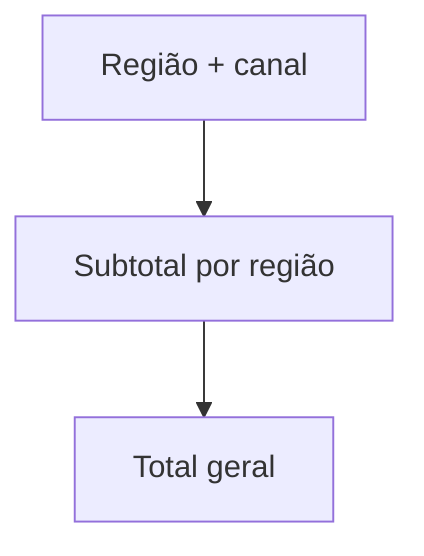

# Agrupamentos Multinível, Totais e Percentis

Relatórios frequentemente precisam de detalhe, subtotal e total. `GROUPING SETS`, `ROLLUP` e `CUBE` expressam vários agrupamentos em uma sentença, mas a disponibilidade varia.

```sql
SELECT regiao, canal, SUM(valor) AS receita
FROM vendas
GROUP BY GROUPING SETS ((regiao, canal), (regiao), ());
```

`ROLLUP(regiao, canal)` produz hierarquia de subtotais; `CUBE` produz todas as combinações. Funções como `GROUPING` distinguem subtotal de valor `NULL` real.



Média é sensível a extremos. Mediana e percentis descrevem distribuição; alguns bancos oferecem `PERCENTILE_CONT` e `PERCENTILE_DISC`. O primeiro interpola; o segundo escolhe valor observado.

Uma média de médias sem ponderação costuma estar errada. Para combinar grupos, carregue soma e contagem ou use pesos explícitos.

> [!warning]
> Totais multinível misturam grãos no mesmo resultado. Inclua colunas que identifiquem o nível para evitar dupla contagem posterior.
