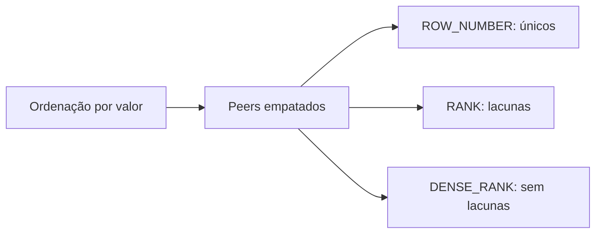

# Ranking: ROW_NUMBER, RANK e NTILE

`ROW_NUMBER` atribui sequência única; `RANK` preserva empates e deixa lacunas; `DENSE_RANK` preserva empates sem lacunas. `NTILE(n)` distribui linhas ordenadas em grupos aproximadamente equilibrados.

```sql
WITH classificados AS (
    SELECT
        cliente_id,
        pedido_id,
        valor,
        ROW_NUMBER() OVER (
            PARTITION BY cliente_id
            ORDER BY valor DESC, pedido_id
        ) AS posicao
    FROM pedidos
)
SELECT * FROM classificados WHERE posicao <= 3;
```



Inclua uma chave estável para desempatar `ROW_NUMBER`. Sem ela, o conjunto top N pode variar.

`NTILE(4)` cria quartis por quantidade de linhas, não percentis estatísticos exatos. Distribuições com muitos empates exigem interpretação cuidadosa.

Escolha a função pela regra de negócio: “três linhas” pede `ROW_NUMBER`; “três melhores posições incluindo empates” pede `RANK` ou `DENSE_RANK`.
