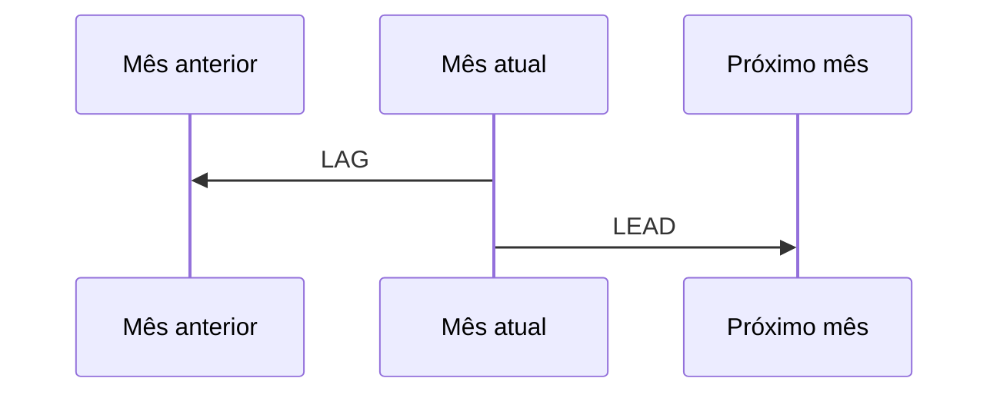

# LAG, LEAD, Primeiro, Último e Comparações

`LAG` acessa linha anterior; `LEAD`, posterior, segundo partição e ordem. São úteis para variação, intervalo e detecção de mudança.

```sql
WITH mensal AS (
    SELECT mes, SUM(valor) AS receita
    FROM vendas GROUP BY mes
)
SELECT
    mes,
    receita,
    LAG(receita) OVER (ORDER BY mes) AS receita_anterior,
    receita - LAG(receita) OVER (ORDER BY mes) AS variacao
FROM mensal;
```

O primeiro período não possui anterior e produz `NULL`. Isso representa ausência de comparação, não variação zero.



`FIRST_VALUE` e `LAST_VALUE` dependem do frame. O frame padrão com ordenação frequentemente termina no peer atual, fazendo `LAST_VALUE` retornar algo diferente do último da partição.

Para toda a partição, declare:

```sql
ROWS BETWEEN UNBOUNDED PRECEDING AND UNBOUNDED FOLLOWING
```

Datas ausentes quebram comparações de períodos. Una a um calendário quando a pergunta exigir continuidade temporal.
