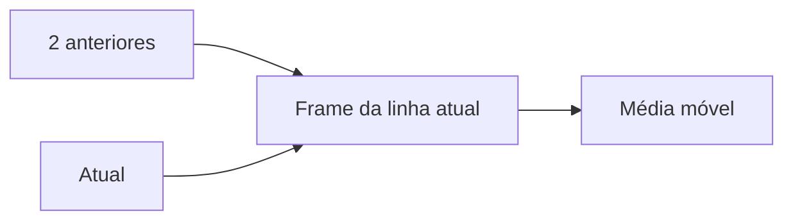

# Frames, Acumulados, Médias Móveis e Testes

O frame é o subconjunto da partição visível para funções sensíveis a ele. `ROWS` conta posições físicas; `RANGE` agrupa peers por valores de ordenação; `GROUPS` conta grupos de peers.

```sql
SELECT
    data_venda,
    valor,
    SUM(valor) OVER (
        ORDER BY data_venda, venda_id
        ROWS BETWEEN UNBOUNDED PRECEDING AND CURRENT ROW
    ) AS acumulado,
    AVG(valor) OVER (
        ORDER BY data_venda, venda_id
        ROWS BETWEEN 2 PRECEDING AND CURRENT ROW
    ) AS media_movel_3
FROM vendas;
```



Declare frames explicitamente para evitar efeitos do padrão e de peers. “Três linhas” não é “três dias”; para calendário, primeiro agregue por dia e preencha lacunas.

Testes analíticos devem cobrir primeira linha, empate, partição com uma linha, `NULL`, período ausente e reconciliação do último acumulado com o total.

> [!tip]
> O último valor de um acumulado por partição deve coincidir com a soma independente da mesma população.
