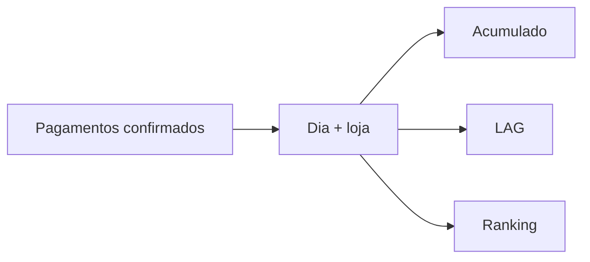

# Estudo de Caso — DataRetail S.A.

A DataRetail S.A. precisa acompanhar receita diária, participação de lojas, top produtos e variação contra o período anterior. Relatórios anteriores misturavam pedidos criados e pagos e calculavam médias de médias.

O contrato passou a considerar somente pagamentos confirmados, no fuso de negócio, agregados primeiro por dia e loja.

```sql
WITH diario AS (
    SELECT data_pagamento, loja_id, SUM(valor) AS receita
    FROM pagamentos
    WHERE status = 'confirmado'
    GROUP BY data_pagamento, loja_id
)
SELECT
    data_pagamento,
    loja_id,
    receita,
    SUM(receita) OVER (PARTITION BY loja_id ORDER BY data_pagamento
        ROWS BETWEEN UNBOUNDED PRECEDING AND CURRENT ROW) AS acumulado,
    LAG(receita) OVER (PARTITION BY loja_id ORDER BY data_pagamento) AS anterior
FROM diario;
```



Testes reconciliam soma diária com total financeiro, verificam última linha acumulada e usam chave estável nos rankings. Um calendário explícito representa dias sem venda.

O ganho principal foi tornar a definição da métrica tão versionada quanto a consulta.
