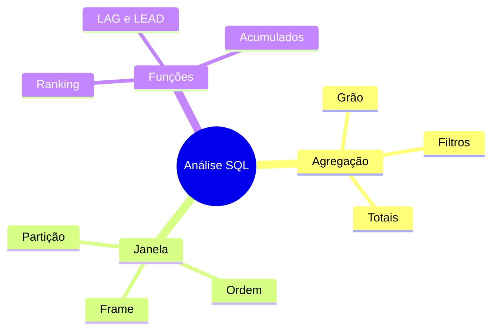

# Resumo

- agregações reduzem conjuntos ao grão dos grupos;
- funções agregadas geralmente ignoram `NULL`;
- `WHERE` filtra linhas e `HAVING` filtra grupos;
- métricas condicionais compartilham a mesma população;
- totais multinível misturam grãos e precisam de identificação;
- funções de janela preservam linhas;
- partição, ordem, peers e frame têm papéis diferentes;
- rankings exigem política de empate e desempate estável;
- `LAG` e `LEAD` comparam posições relativas;
- `FIRST_VALUE` e `LAST_VALUE` dependem do frame;
- acumulados e médias móveis devem declarar frames;
- métricas precisam de reconciliação e casos-limite.

