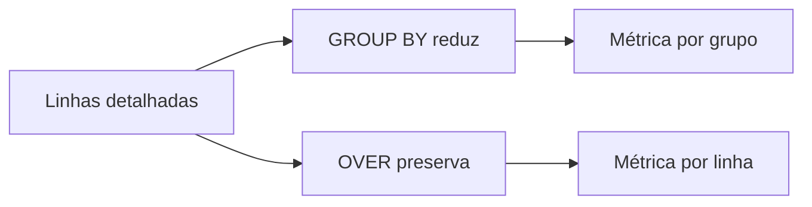

# Módulo 03 — Agregações, Funções de Janela e Análise

Agregações reduzem linhas ao grão de um grupo. Funções de janela calculam sobre linhas relacionadas preservando o detalhe. Dominar essa diferença permite construir métricas, rankings, acumulados e comparações temporais corretas.

## Percurso

1. [[01-Objetivos|Objetivos]]
2. [[02-Introducao|Introdução]]
3. [[03-Agregacao-Grao-e-Funcoes-Fundamentais|Agregação, Grão e Funções Fundamentais]]
4. [[04-GROUP-BY-HAVING-FILTER-e-Agregacao-Condicional|GROUP BY, HAVING, FILTER e Agregação Condicional]]
5. [[05-Agrupamentos-Multinivel-Totais-e-Percentis|Agrupamentos Multinível, Totais e Percentis]]
6. [[06-Funcoes-de-Janela-Particoes-Ordem-e-Peers|Funções de Janela, Partições, Ordem e Peers]]
7. [[07-Ranking-ROW-NUMBER-RANK-e-NTILE|Ranking: ROW_NUMBER, RANK e NTILE]]
8. [[08-LAG-LEAD-Primeiro-Ultimo-e-Comparacoes|LAG, LEAD, Primeiro, Último e Comparações]]
9. [[09-Frames-Acumulados-Medias-Moveis-e-Testes|Frames, Acumulados, Médias Móveis e Testes]]
10. [[10-Estudo-de-Caso-DataRetail|Estudo de Caso — DataRetail S.A.]]
11. [[11-Resumo|Resumo]]
12. [[12-Perguntas-de-Entrevista|Perguntas de Entrevista]]
13. [[13-Exercicios|Exercícios]] e [[13-Gabarito|Gabarito]]
14. [[14-Laboratorio|Laboratório]] e [[14-Solucao|Solução]]
15. [[15-Referencias|Referências]]

