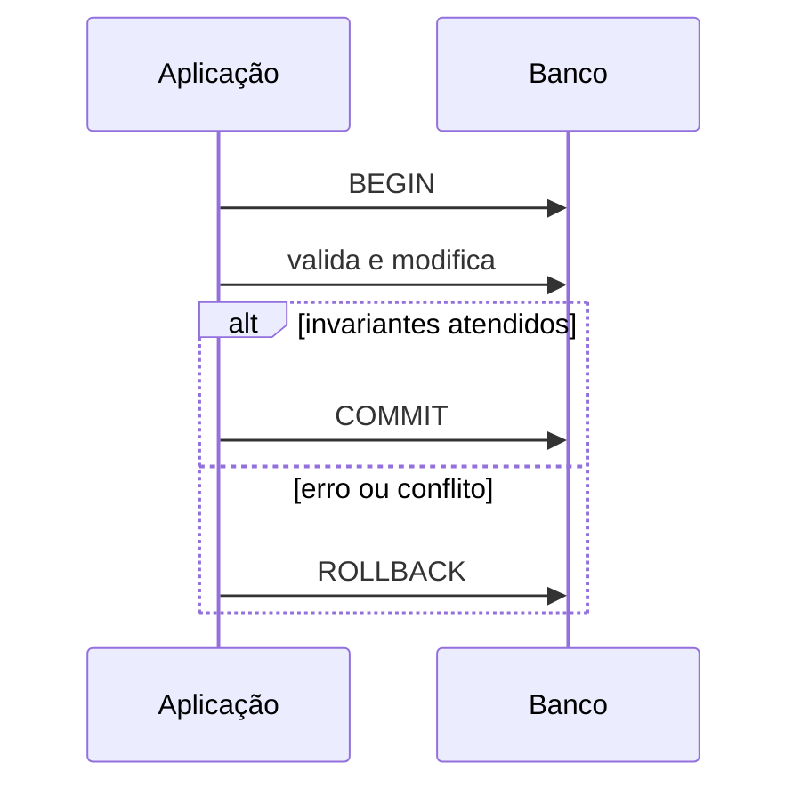

# Introdução

Uma transferência, carga incremental ou mudança de status costuma envolver várias linhas e tabelas. Se apenas parte for aplicada, o banco pode ficar internamente válido, mas incorreto para o negócio.

Transações agrupam operações numa unidade. Isolamento controla o que execuções concorrentes observam; mecanismos como MVCC e locks implementam essas garantias.

O nível mais forte não elimina conflitos: execuções serializáveis podem abortar e exigir retry. A aplicação deve combinar restrições, idempotência e tratamento explícito de falhas.

> [!warning]
> Uma transação aberta enquanto aguarda rede ou interação humana retém recursos e amplia contenção.
