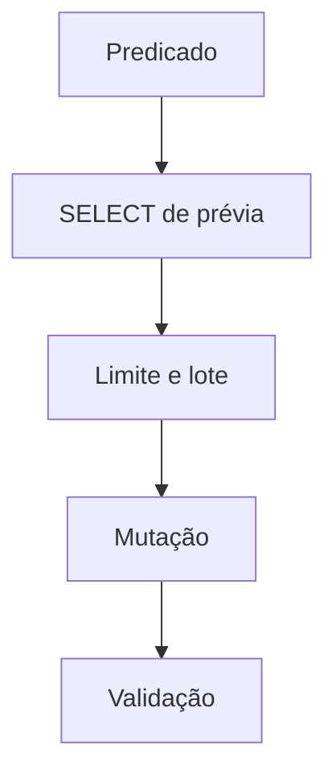

# UPDATE, DELETE, Predicados e Mutações em Lote

`UPDATE` modifica linhas selecionadas; `DELETE` remove. O predicado é parte do contrato e deve ser testado como `SELECT` antes de uma operação crítica.

```sql
UPDATE pedidos
SET status = 'expirado'
WHERE status = 'pendente'
  AND criado_em < CURRENT_DATE - INTERVAL '30 days';
```

```sql
DELETE FROM eventos_processados
WHERE processado_em < DATE '2025-01-01';
```

Valide quantidade afetada, use transação e registre critérios. Operações enormes podem gerar locks prolongados, logs volumosos e atraso de réplicas; lotes por chave estável reduzem impacto.



Soft delete preserva histórico com coluna de estado, mas exige filtros consistentes e política de retenção. Não substitui auditoria.

> [!warning]
> Um `UPDATE` sem `WHERE` pode ser legítimo, mas deve ser explícito, revisado e protegido como operação de alto risco.
