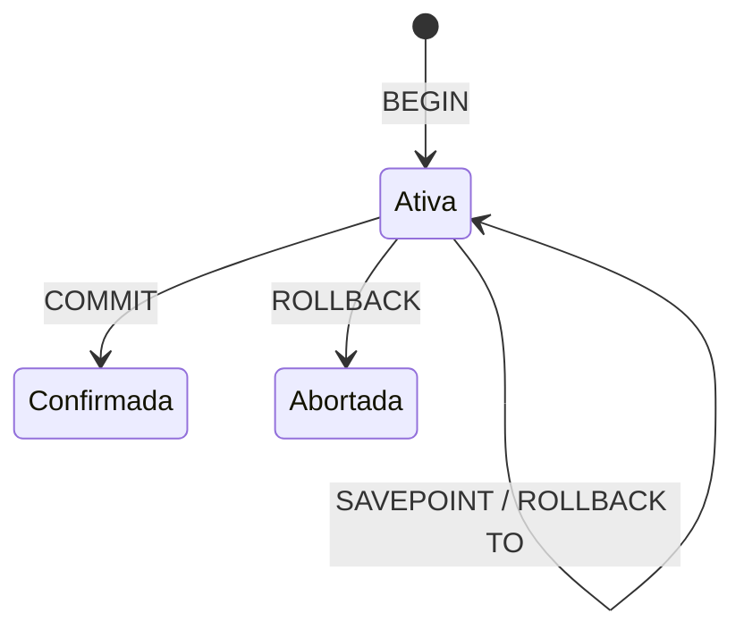

# Transações, ACID, COMMIT, ROLLBACK e SAVEPOINT

Atomicidade aplica tudo ou nada. Consistência preserva invariantes definidos. Isolamento controla interferência concorrente. Durabilidade mantém commits apesar de falhas dentro das garantias do sistema.

```sql
BEGIN;
UPDATE contas SET saldo = saldo - 100 WHERE conta_id = 1;
UPDATE contas SET saldo = saldo + 100 WHERE conta_id = 2;
COMMIT;
```

Se qualquer validação falhar, use `ROLLBACK`. `SAVEPOINT` cria ponto interno para desfazer parte sem cancelar toda a transação:

```sql
SAVEPOINT antes_item;
-- operação opcional
ROLLBACK TO SAVEPOINT antes_item;
RELEASE SAVEPOINT antes_item;
```



SQLite não permite `BEGIN` aninhado; savepoints oferecem aninhamento lógico. Erros podem abortar somente a sentença ou a transação conforme mecanismo e classe do erro: trate estado transacional explicitamente.
