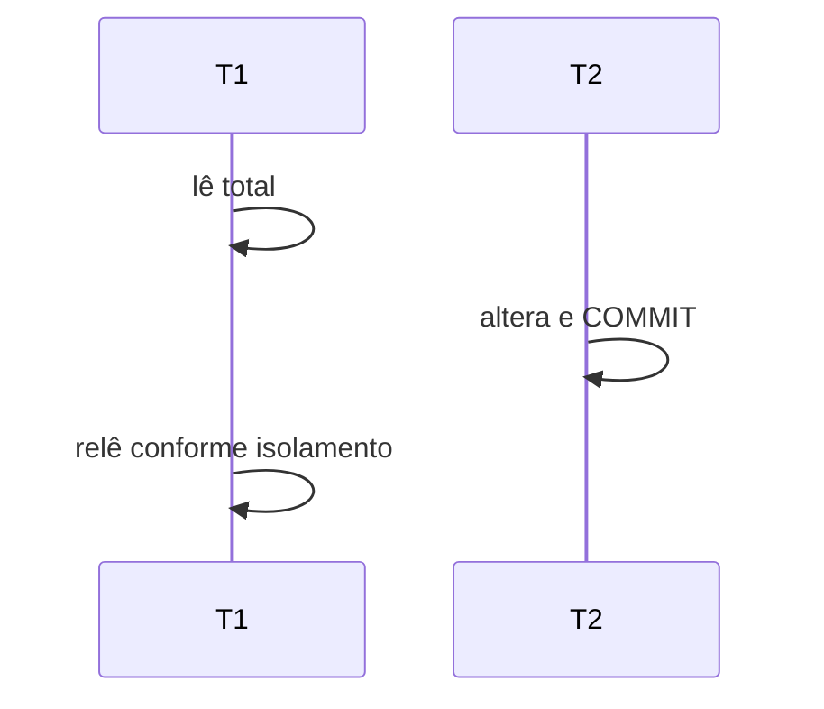

# Isolamento, Snapshots e Anomalias de Concorrência

O padrão define níveis em termos de fenômenos permitidos. Implementações podem oferecer garantias mais fortes e nomes iguais com comportamentos diferentes.

| Fenômeno | Descrição |
| --- | --- |
| dirty read | lê mudança não confirmada |
| nonrepeatable read | mesma linha muda entre leituras |
| phantom | predicado encontra conjunto diferente |
| serialization anomaly | resultado impossível em ordem serial |

`READ COMMITTED` frequentemente cria snapshot por sentença. `REPEATABLE READ` tende a manter snapshot transacional. `SERIALIZABLE` exige efeito equivalente a alguma ordem serial e pode abortar uma transação.

Write skew ocorre quando transações leem o mesmo conjunto e atualizam linhas diferentes, violando um invariante conjunto. Locks adequados, constraint materializada ou serializable podem ser necessários.

> [!warning]
> A aplicação deve estar preparada para retry em níveis que detectam conflitos de serialização.
