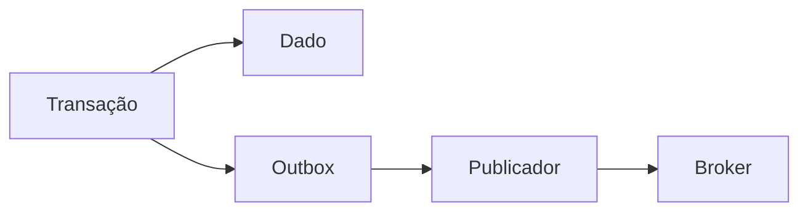

# Retries, Transações Curtas, Outbox e Operação

Deadlock, serialization failure e indisponibilidade transitória podem justificar retry. Repita a transação inteira com limite, backoff e jitter; não repita cegamente erros permanentes.

```python
for tentativa in range(3):
    try:
        executar_transacao()
        break
    except ConflitoTransitorio:
        aguardar_com_jitter(tentativa)
```

A função precisa ser idempotente ou protegida por chave única. Depois de timeout no cliente, o commit pode ter ocorrido: uma chave de operação permite consultar ou repetir com segurança.

Banco e broker não compartilham atomicidade automaticamente. O padrão outbox grava mudança de domínio e evento na mesma transação; um publicador envia eventos pendentes e marca progresso.



Mantenha transações curtas: prepare dados antes, execute apenas leituras e escritas necessárias, confirme e faça efeitos externos depois.

Observe taxa de abortos, retries, lock wait, deadlocks, idade de transações e crescimento de versões.
