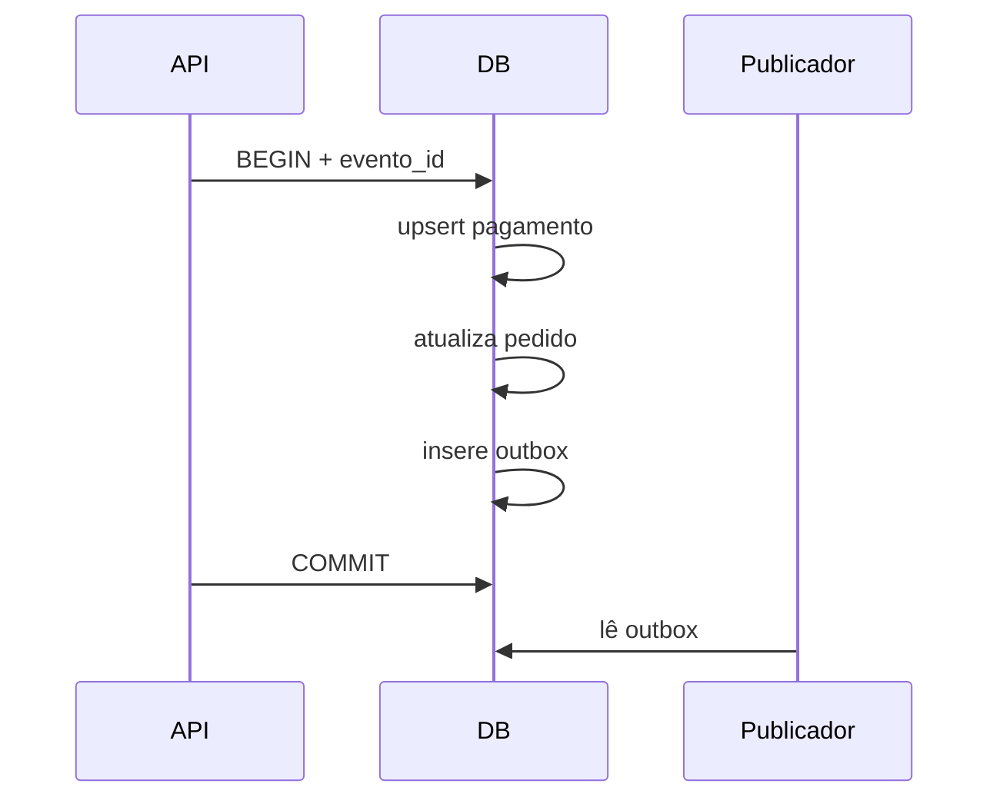

# Estudo de Caso — DataRetail S.A.

A DataRetail S.A. recebia callbacks duplicados de pagamento e, em falhas raras, marcava pedido como pago sem registrar o evento de integração.

O time introduziu chave única `evento_id`, versão do pedido e outbox. A transação valida o estado, atualiza pedido, registra pagamento e insere evento.

Callbacks repetidos convergem para o mesmo estado. Conflitos transitórios repetem a transação inteira. Estoque é bloqueado por produto em ordem crescente para reduzir deadlocks.

Constraints impedem saldo negativo e transição inválida. Métricas acompanham duplicatas, retries, espera de lock e idade da outbox.

O resultado foi consistência entre estado interno e intenção de publicação sem depender de transação distribuída com o broker.
