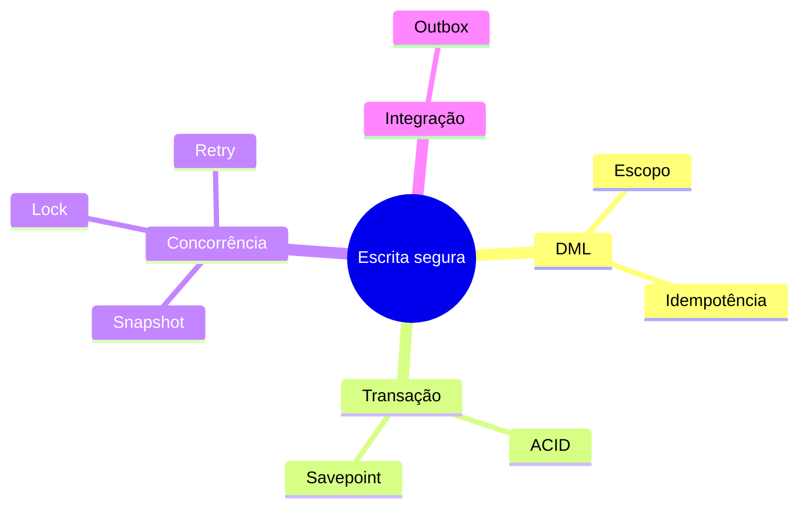

# Resumo

- `INSERT`, `UPDATE` e `DELETE` devem nomear escopo e validar efeitos;
- `RETURNING` evita leituras adicionais sujeitas a corrida;
- upsert correto depende de constraint única;
- idempotência protege reprocessamento e resultados ambíguos;
- transações delimitam unidades atômicas;
- savepoints oferecem recuperação parcial;
- isolamento controla visibilidade e anomalias;
- serializable pode exigir retry;
- MVCC oferece snapshots, mas não elimina locks;
- ordem consistente de aquisição reduz deadlocks;
- retries devem ser limitados e repetir a unidade inteira;
- outbox une mudança de domínio e intenção de evento.

