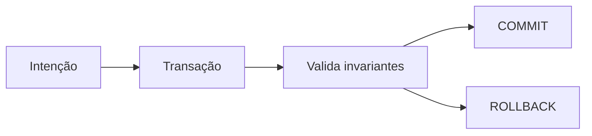

# Módulo 04 — DML, Transações e Concorrência

Alterar dados exige mais que sintaxe: a operação deve preservar invariantes mesmo diante de falhas, repetição e concorrência. Este módulo conecta DML a atomicidade, isolamento, locks e estratégias de retry.

## Percurso

1. [[01-Objetivos|Objetivos]]
2. [[02-Introducao|Introdução]]
3. [[03-INSERT-VALUES-SELECT-e-RETURNING|INSERT, VALUES, SELECT e RETURNING]]
4. [[04-UPDATE-DELETE-Predicados-e-Mutacoes-em-Lote|UPDATE, DELETE, Predicados e Mutações em Lote]]
5. [[05-Upsert-MERGE-Idempotencia-e-Deduplicacao|Upsert, MERGE, Idempotência e Deduplicação]]
6. [[06-Transacoes-ACID-COMMIT-ROLLBACK-e-SAVEPOINT|Transações, ACID, COMMIT, ROLLBACK e SAVEPOINT]]
7. [[07-Isolamento-Snapshots-e-Anomalias-de-Concorrencia|Isolamento, Snapshots e Anomalias de Concorrência]]
8. [[08-Locks-MVCC-Bloqueios-e-Deadlocks|Locks, MVCC, Bloqueios e Deadlocks]]
9. [[09-Retries-Transacoes-Curtas-Outbox-e-Operacao|Retries, Transações Curtas, Outbox e Operação]]
10. [[10-Estudo-de-Caso-DataRetail|Estudo de Caso — DataRetail S.A.]]
11. [[11-Resumo|Resumo]]
12. [[12-Perguntas-de-Entrevista|Perguntas de Entrevista]]
13. [[13-Exercicios|Exercícios]] e [[13-Gabarito|Gabarito]]
14. [[14-Laboratorio|Laboratório]] e [[14-Solucao|Solução]]
15. [[15-Referencias|Referências]]

