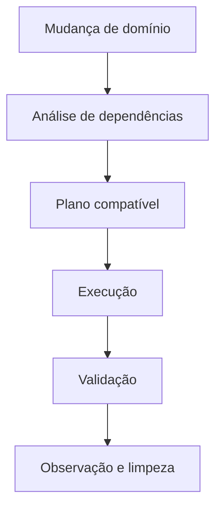

# Introdução

Schemas codificam contratos entre produtores, consumidores e o banco. Renomear uma coluna ou estreitar um tipo afeta aplicações, consultas, views, cargas e réplicas.

Uma sentença rápida em desenvolvimento pode bloquear uma tabela grande ou validar milhões de linhas em produção. O plano deve distinguir mudança de catálogo, scan, reescrita e construção de índice.

Expand-contract separa a mudança incompatível em fases compatíveis. Durante a transição, duas versões da aplicação podem coexistir.

> [!warning]
> DDL é frequentemente transacional, mas limites e comportamento variam por mecanismo e operação. Teste no mesmo produto e versão do destino.
