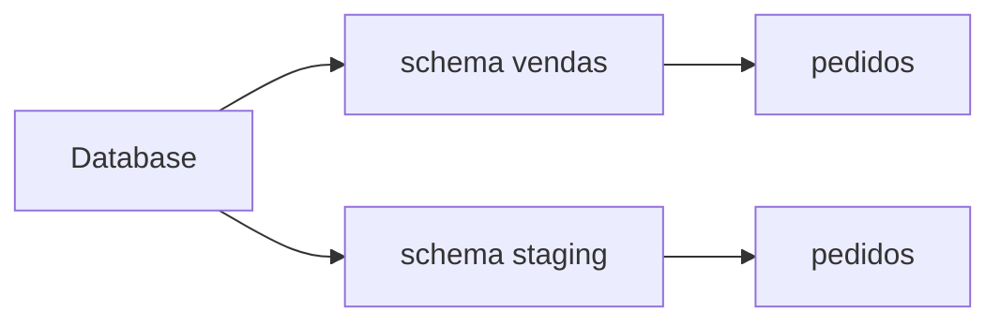

# DDL, Objetos, Nomes e Namespaces

DDL cria, altera e remove objetos como schemas, tabelas, views, sequências e índices. Um schema funciona como namespace dentro do banco em mecanismos que o suportam.

```sql
CREATE SCHEMA vendas;
CREATE TABLE vendas.pedidos (
    pedido_id BIGINT PRIMARY KEY,
    criado_em TIMESTAMP NOT NULL
);
```

Nomes qualificados reduzem ambiguidade e risco de resolver objeto indevido via caminho de busca. Nunca construa identificadores com entrada não confiável.



Convenções precisam equilibrar clareza, estabilidade e limites do dialeto. Identificadores entre aspas preservam caixa e caracteres, mas aumentam fricção; prefira nomes simples.

`CREATE IF NOT EXISTS` ajuda scripts repetíveis, mas não prova que a estrutura existente corresponde à desejada. Migrações devem verificar versão e definição.
