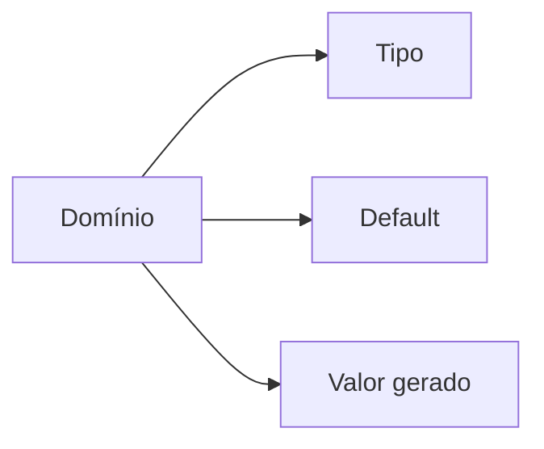

# Tipos, Defaults, Colunas Geradas e Identidade

Tipos definem representação, operações e limites. Escolha pelo domínio: inteiro para contagens, decimal para valores exatos, tipos temporais com política de fuso e texto com tamanho apenas quando houver regra real.

```sql
CREATE TABLE produtos (
    produto_id BIGINT GENERATED ALWAYS AS IDENTITY PRIMARY KEY,
    preco NUMERIC(12, 2) NOT NULL,
    quantidade INTEGER NOT NULL DEFAULT 0,
    valor_estoque NUMERIC(14, 2)
        GENERATED ALWAYS AS (preco * quantidade) STORED
);
```

Default se aplica quando a coluna é omitida, não retroativamente. `NULL` explícito normalmente continua nulo. Funções voláteis em defaults podem exigir cálculo por linha e encarecer migração.



Identidade gera chave substituta; não substitui chaves naturais e constraints de unicidade. Alterar tipo pode exigir conversão, scan ou reescrita e deve tratar valores incompatíveis antes.
