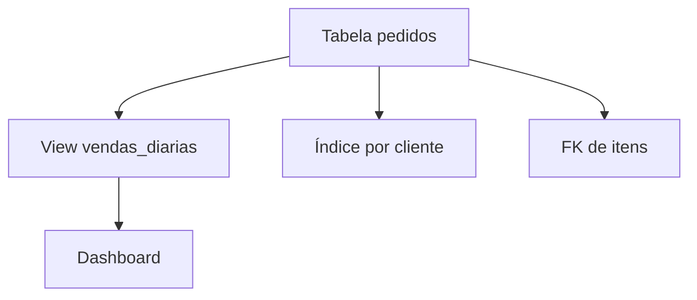

# Dependências, Views, Índices e Ciclo de Vida

Views, índices, foreign keys, triggers e permissões dependem de tabelas e colunas. O banco rastreia parte dessas relações; consumidores externos exigem catálogo e busca adicional.

`DROP ... CASCADE` remove dependências conhecidas e pode ampliar muito o impacto. Prefira inspecionar, migrar e remover explicitamente.

Views estabilizam interfaces, mas `SELECT *` propaga acoplamento. Declare colunas e trate mudança de semântica como mudança de contrato.

Índices apoiam constraints e acesso, porém cobram armazenamento e custo de escrita. Criá-los em tabelas grandes pode demandar modo concorrente específico do produto.

Antes da mudança, inventarie consultas, jobs, views, triggers, FKs, índices, permissões, CDC e replicação. Dependência invisível costuma ser o maior risco de um rename.
