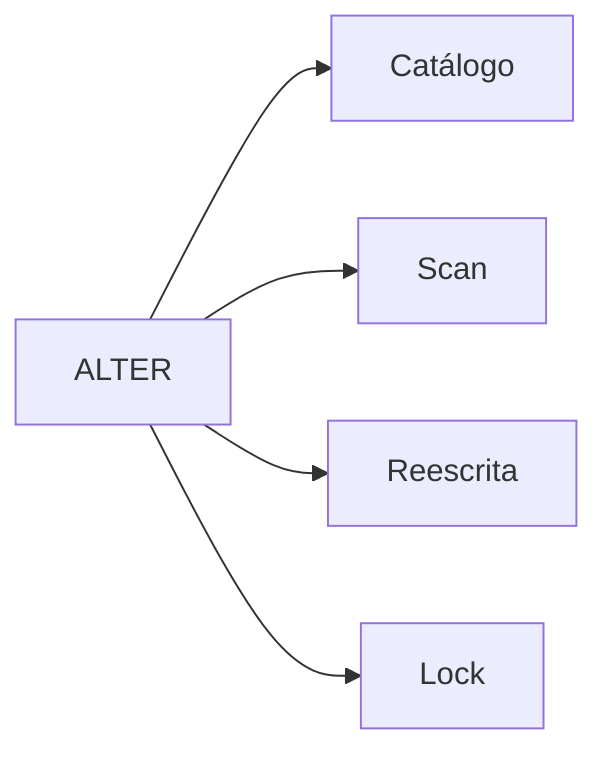

# ALTER TABLE, Locks, Reescritas e Validação

`ALTER TABLE` pode alterar apenas catálogo, ler toda tabela, reescrever dados ou bloquear acessos incompatíveis. O comportamento depende da ação, versão e tipo.

```sql
ALTER TABLE pedidos ADD COLUMN canal TEXT;
ALTER TABLE pedidos ADD CONSTRAINT ck_canal
    CHECK (canal IN ('web', 'loja'));
```

Adicionar `NOT NULL` a dados existentes exige provar ausência de nulos. Uma estratégia segura adiciona coluna opcional, preenche em lotes, valida e só então endurece.



Configure timeout de lock para falhar cedo em vez de parar produção. Meça duração, filas, WAL/log, réplica e espaço temporário.

SQLite suporta subconjunto de `ALTER TABLE`; mudanças gerais usam criação de nova tabela, cópia, reconstrução de dependências e troca dentro de transação.

> [!warning]
> Testar apenas com tabela vazia não revela custo de validação nem reescrita.
