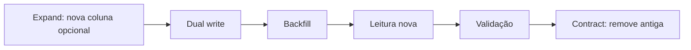

# Expand-Contract, Backfill, Compatibilidade e Rollback

Expand-contract evita uma troca incompatível instantânea. Primeiro adiciona-se a nova forma; depois dados e aplicações migram; por fim o legado é removido.

Backfill deve ser idempotente, paginado por chave, observável e retomável. Proteja dados novos contra sobrescrita por lotes antigos.

Dual write na aplicação pode divergir; quando possível, derive uma forma da outra no banco ou valide continuamente. Defina qual coluna é autoritativa em cada fase.

Rollback de código só é seguro se o schema continuar compatível. Depois que escritores novos gravam valores que o código antigo não entende, restaurar binário não basta.

Renomear coluna é semanticamente drop + add para consumidores. Use coexistência, view ou alias temporário quando zero downtime for necessário.
