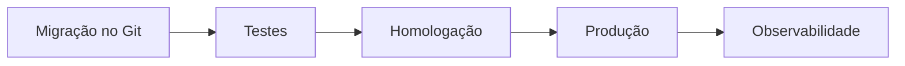

# Migrações Versionadas, Testes, Observabilidade e Governança

Cada migração precisa de identificador único, ordem, descrição, checksum e estado aplicado. Arquivos já executados não devem ser editados; correções entram como nova migração.

```text
V001__cria_pedidos.sql
V002__adiciona_canal.sql
V003__valida_canal.sql
```

Teste em banco vazio, upgrade a partir da versão anterior e cópia com volume representativo. Valide schema, dados, constraints, dependências e compatibilidade da aplicação.



Durante execução, monitore lock wait, duração, throughput, erros, lag de réplica e espaço. Defina critérios objetivos de pausa.

Revisão deve incluir proprietário, impacto, janela, plano de backfill, rollback/roll-forward e evidências. Migração destrutiva requer confirmação de que nenhum consumidor usa o objeto.

> [!tip]
> O melhor rollback para muitas mudanças de schema é parar, manter a expansão compatível e corrigir por roll-forward.
