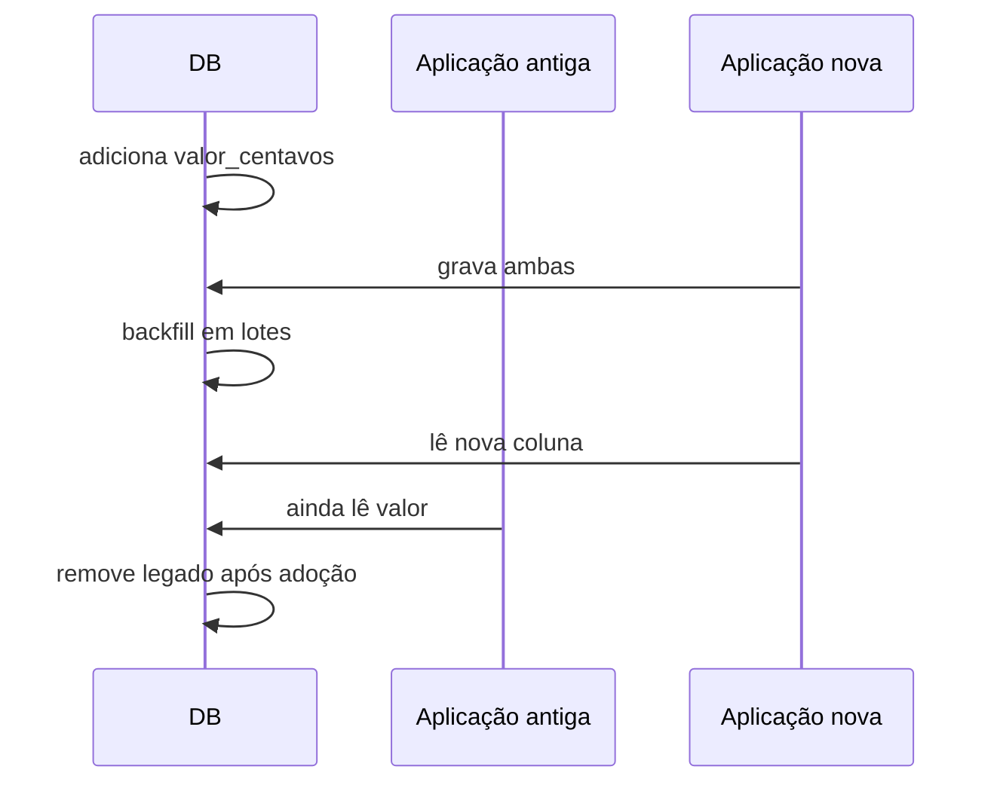

# Estudo de Caso — DataRetail S.A.

A DataRetail S.A. precisa substituir `valor` por `valor_centavos`, eliminando ambiguidade de moeda sem interromper APIs e pipelines antigos.

O time adiciona a coluna opcional, publica escritor duplo e executa backfill por `pedido_id`. Uma reconciliação verifica `valor_centavos = ROUND(valor * 100)`.

O `NOT NULL` só é aplicado após contagem de nulos igual a zero. Dashboards e CDC são migrados antes da contração. O rollback de aplicação permanece possível durante toda a expansão.

Métricas acompanham lotes, divergências, locks e lag. A remoção ocorre semanas depois, com evidência de ausência de leitores antigos.
