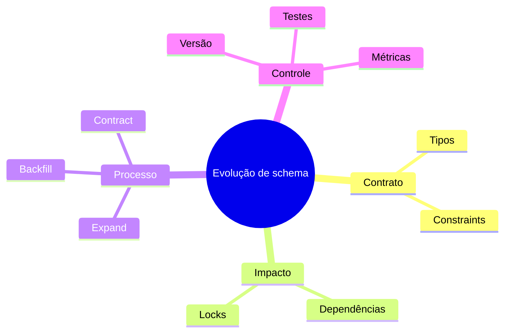

# Resumo

- DDL gerencia objetos persistentes e seus contratos;
- schemas organizam namespaces e permissões;
- tipos, defaults e colunas geradas têm semânticas distintas;
- constraints protegem invariantes para qualquer escritor;
- dependências internas e externas precisam de inventário;
- `ALTER TABLE` pode exigir lock, scan ou reescrita;
- expand-contract preserva compatibilidade durante coexistência;
- backfills devem ser idempotentes, retomáveis e observáveis;
- rollback depende da compatibilidade dos dados novos;
- migrações aplicadas são imutáveis e recebem versão;
- testes devem cobrir instalação limpa, upgrade e volume realista;
- contração destrutiva ocorre somente após evidência de desuso.

