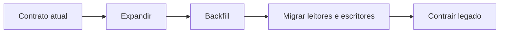

# Módulo 05 — DDL, Schemas e Evolução de Estruturas

DDL transforma decisões de domínio em objetos persistentes. Em produção, alterar esses objetos exige compreender dependências, validação, locks, custo de reescrita e compatibilidade entre versões da aplicação.

## Percurso

1. [[01-Objetivos|Objetivos]]
2. [[02-Introducao|Introdução]]
3. [[03-DDL-Objetos-Nomes-e-Namespaces|DDL, Objetos, Nomes e Namespaces]]
4. [[04-Tipos-Defaults-Colunas-Geradas-e-Identidade|Tipos, Defaults, Colunas Geradas e Identidade]]
5. [[05-Constraints-Chaves-e-Integridade-Declarativa|Constraints, Chaves e Integridade Declarativa]]
6. [[06-Dependencias-Views-Indices-e-Ciclo-de-Vida|Dependências, Views, Índices e Ciclo de Vida]]
7. [[07-ALTER-TABLE-Locks-Reescritas-e-Validacao|ALTER TABLE, Locks, Reescritas e Validação]]
8. [[08-Expand-Contract-Backfill-Compatibilidade-e-Rollback|Expand-Contract, Backfill, Compatibilidade e Rollback]]
9. [[09-Migracoes-Versionadas-Testes-Observabilidade-e-Governanca|Migrações Versionadas, Testes, Observabilidade e Governança]]
10. [[10-Estudo-de-Caso-DataRetail|Estudo de Caso — DataRetail S.A.]]
11. [[11-Resumo|Resumo]]
12. [[12-Perguntas-de-Entrevista|Perguntas de Entrevista]]
13. [[13-Exercicios|Exercícios]] e [[13-Gabarito|Gabarito]]
14. [[14-Laboratorio|Laboratório]] e [[14-Solucao|Solução]]
15. [[15-Referencias|Referências]]

