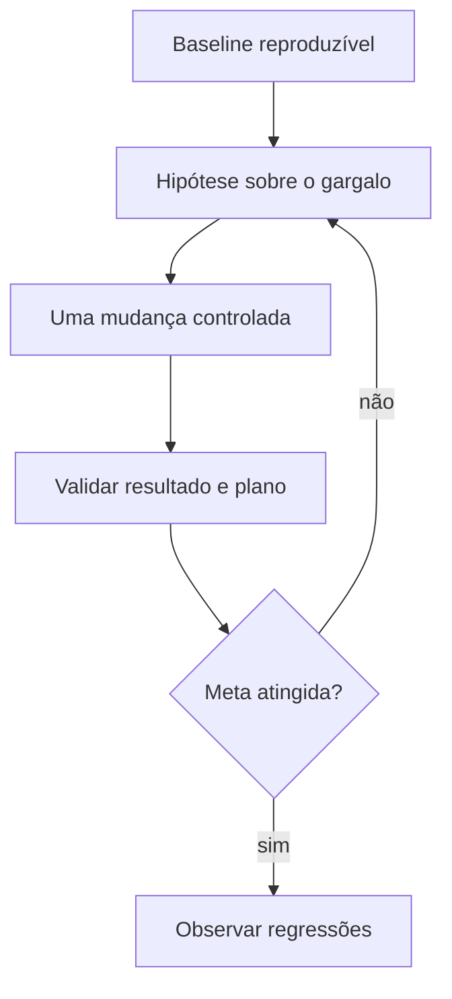

# Introdução

Uma consulta descreve **o resultado**, enquanto o banco decide **como obtê-lo**. Para a mesma expressão SQL, o otimizador pode ler uma tabela inteira, percorrer um índice, construir uma tabela hash ou ordenar conjuntos intermediários. A escolha depende do esquema, dos dados, das estatísticas, dos recursos e dos operadores disponíveis.

Tempo isolado é um sinal insuficiente: cache, concorrência e infraestrutura alteram a medição. Um diagnóstico robusto combina plano, linhas estimadas e reais, leituras, memória, temporários e repetição controlada.

Na DataRetail S.A., relatórios lentos não serão tratados com a regra simplista “adicione um índice”. O ponto de partida será o caminho crítico: quantas linhas entram em cada operador, quantas sobrevivem e onde ocorre I/O, CPU ou espera.
