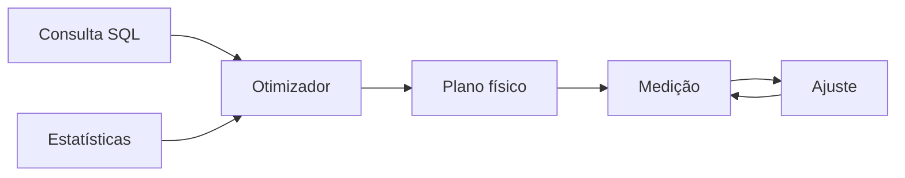

# Módulo 06 — Planos de Execução, Índices e Otimização

Otimizar SQL não significa decorar índices ou reescrever consultas ao acaso. Significa compreender como o otimizador estima alternativas, observar o plano realmente executado e reduzir trabalho sem violar o contrato do resultado.

## Percurso

1. [[01-Objetivos|Objetivos]]
2. [[02-Introducao|Introdução]]
3. [[03-Do-SQL-ao-Plano-Logico-e-Fisico|Do SQL ao Plano Lógico e Físico]]
4. [[04-Custo-Cardinalidade-Seletividade-e-Estatisticas|Custo, Cardinalidade, Seletividade e Estatísticas]]
5. [[05-Scans-Filtros-Sorts-e-Materializacao|Scans, Filtros, Sorts e Materialização]]
6. [[06-Indices-B-Tree-Compostos-Parciais-e-Cobertura|Índices B-tree, Compostos, Parciais e de Cobertura]]
7. [[07-Algoritmos-de-Join-Nested-Loop-Hash-e-Merge|Algoritmos de Join]]
8. [[08-EXPLAIN-ANALYZE-Leitura-de-Planos-e-Diagnostico|EXPLAIN ANALYZE e Diagnóstico]]
9. [[09-SARGabilidade-Memoria-e-Metodo-de-Otimizacao|SARGabilidade, Memória e Método de Otimização]]
10. [[10-Estudo-de-Caso-DataRetail|Estudo de Caso — DataRetail S.A.]]
11. [[11-Resumo|Resumo]]
12. [[12-Perguntas-de-Entrevista|Perguntas de Entrevista]]
13. [[13-Exercicios|Exercícios]] e [[13-Gabarito|Gabarito]]
14. [[14-Laboratorio|Laboratório]] e [[14-Solucao|Solução]]
15. [[15-Referencias|Referências]]

