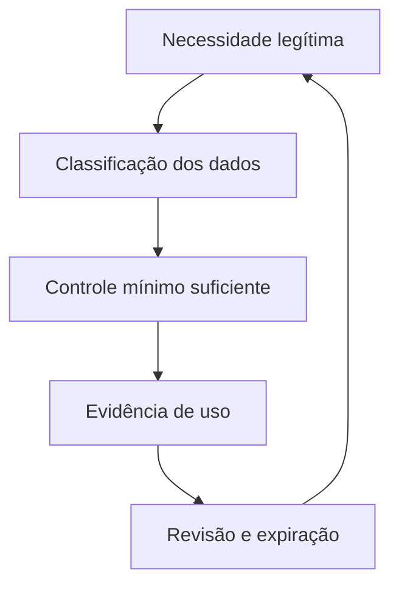

# Introdução

Conceder acesso a um banco não é uma decisão binária. É preciso responder **quem**, **por qual identidade**, **para qual finalidade**, **sobre quais dados**, **com quais operações**, **por quanto tempo** e **sob qual evidência**.

Views reduzem acoplamento e exposição; roles agrupam capacidades; políticas restringem linhas; parâmetros separam dados de código; auditoria registra eventos relevantes. Governança transforma esses mecanismos em um processo com responsáveis, revisão e expiração.

Na DataRetail S.A., um analista precisa de receita por loja, não necessariamente de nomes, e-mails ou leitura direta das tabelas transacionais. O contrato de acesso deve refletir essa finalidade.
